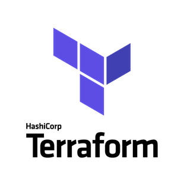

## What terraform is

[Introduction to HashiCorp Terraform with Armon Dadgar](https://www.youtube.com/watch?v=h970ZBgKINg)

[Terraform is a tool for building, evolve, changing, and versioning infrastructure safely and efficiently.](https://www.terraform.io/intro/index.html)

Terraform give us the workflow to manage infrastructure

Terraform has the follow commands to mange the infrastructure workflow

1) refresh = show us a terraform view of the real world infrastructure
2) plan = match the real world with the desire configuration
3) apply = execute plan against the real world
4) destroy = match the plan with the real world to delete resources

Terraform has the power to decide if the things will be executed in parallel or sequential

terraform is build by:

one core component which interact with TF Configurations and TF State and over 100 provides as you can have a list on [list](https://www.terraform.io/docs/providers/index.html)